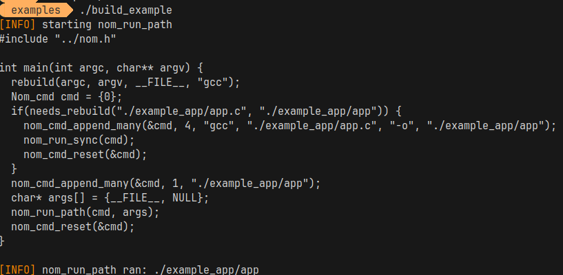

start date: 12/17/23

 i got inspiration for this project from tsoding: https://youtube.com/tsodingdaily 

the name of this build tool is NoMake™. 

for reference on how to set up your project, refer to nom.c and nom.h

examples/ has examples on the API for nom.h as well as a minimal example of using nom.h to run a program and passing command line arguments to it.

